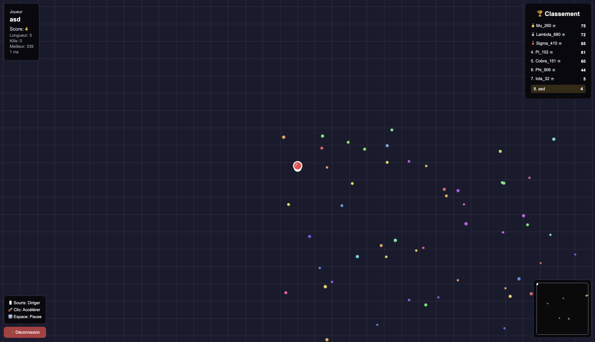
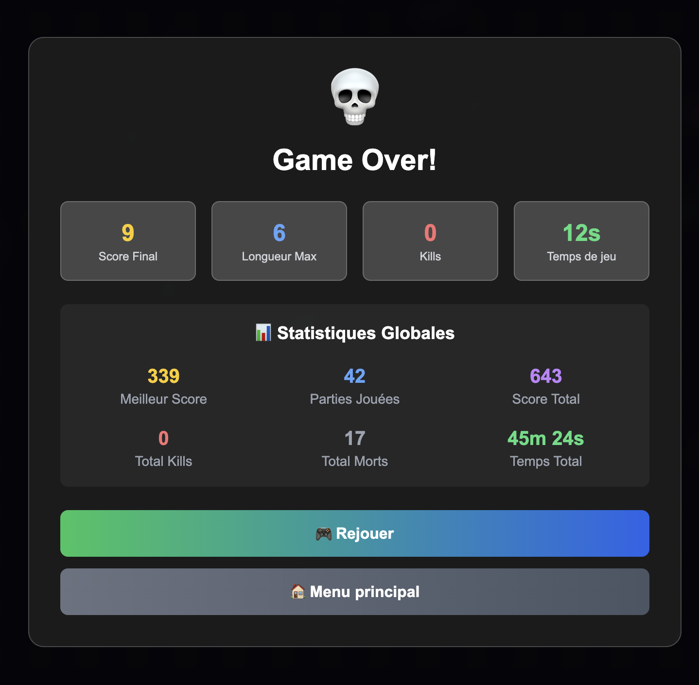
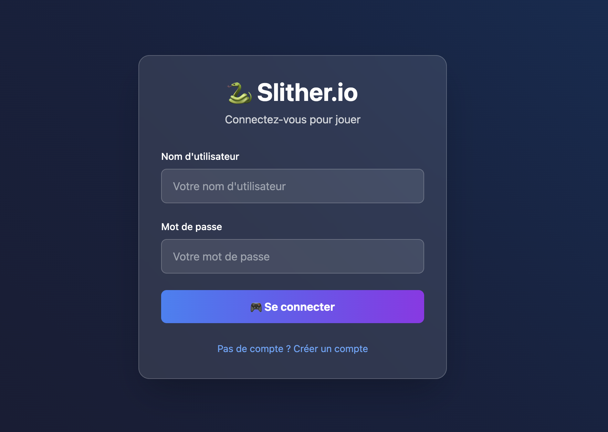
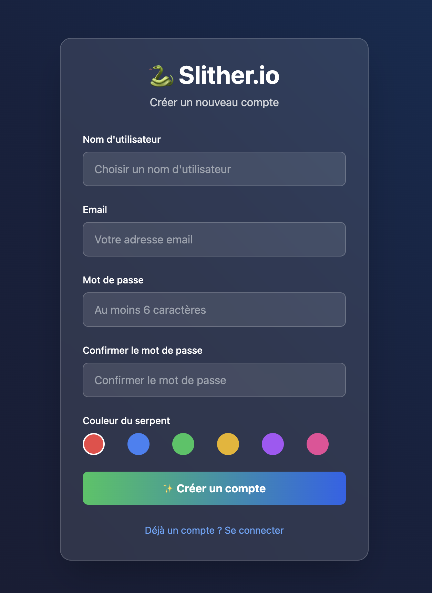

# 🐍 Slither.io Clone

Un clone complet de Slither.io avec serveur multijoueur en temps réel, bots IA, base de données SQLite, et déploiement Dockerisé.

---

## ✨ Fonctionnalités

- **Multijoueur en temps réel** : Affrontez d’autres joueurs connectés en direct.
- **Bots IA intelligents** : 10 bots simulant des comportements réalistes (recherche de nourriture, fuite, attaque, respawn automatique).
- **Classement en direct** : Tableau des scores mis à jour en temps réel.
- **Graphismes modernes** : Interface utilisateur attrayante avec effets visuels.
- **Monde toroïdal** : Téléportation aux bords du monde.
- **Caméra dynamique** : Vue centrée sur votre serpent.
- **Gestion complète des comptes** : Inscription, connexion sécurisée (JWT + bcrypt), statistiques utilisateur (meilleur score, parties jouées, kills, temps de jeu, etc.).
- **Statistiques de jeu** : Suivi du score, kills, morts, temps de jeu, et records personnels.
- **Respawn automatique** : Pour les bots et les joueurs.
- **Boost et particules** : Boost du serpent avec perte de segments convertis en particules de nourriture.
- **Détection avancée des collisions** : Gestion précise des collisions entre serpents, nourriture, et bords.
- **Interface responsive** : Contrôles souris fluides, design adaptatif.

---

## 🖼️ Galerie



- **En haut à gauche** : Affichage de vos statistiques en temps réel, incluant le score actuel, la longueur de votre serpent, le nombre de kills, votre meilleur score historique et le ping avec le serveur.
- **En bas à gauche** : Rappel des commandes principales du jeu ainsi qu’un bouton pour se déconnecter rapidement.
- **en haut à droite** : Tableau de classement (leaderboard) affichant les meilleurs joueurs de la partie en direct.
- **en bas à droite** : Mini-carte permettant de visualiser la position des autres joueurs et de repérer facilement les adversaires.
---

On a un récapitulatif de notre score sur notre partie et aussi nos meillieurs stats global
---

---



---

## 🚀 Installation & Démarrage

### Prérequis

- Node.js (18+)
- npm ou yarn
- Docker (optionnel, recommandé pour la production)

### Installation manuelle

1. **Cloner le dépôt**
   ```bash
   git clone  && cd slither-io-clone
   ```
2. **Installer les dépendances**
   ```bash
   npm install
   ```
3. **Initialiser la base de données**
   ```bash
   node scripts/init-db.js
   ```
4. **Démarrer le serveur**
   ```bash
   npm start
   ```
5. **Ouvrir le jeu**
   Rendez-vous sur `http://localhost:3000`

---

## 🐳 Déploiement avec Docker

### Docker simple

1. **Construire l’image**
   ```bash
   docker build -t slither-io-clone .
   ```
2. **Lancer le conteneur**
   ```bash
   docker run -d -p 3000:3000 --name slither slither-io-clone
   ```
   - Le port par défaut est 3000, modifiable via la variable d’environnement `PORT`.

### Docker Compose (exemple)

```yaml
version: '3'
services:
  slither:
    build: .
    ports:
      - "3000:3000"
    volumes:
      - ./game.db:/app/game.db
    environment:
      - PORT=3000
```

### Initialisation de la base de données

Avant le premier lancement, initialisez la base SQLite :
```bash
docker exec -it slither node scripts/init-db.js
```

---

## 🗃️ Script de création de la base de données

Le script [`scripts/init-db.js`](scripts/init-db.js) initialise la base SQLite :

- Création de la table `users` avec :
  - `id`, `username`, `password` (hashé), `email`
  - Statistiques : `best_score`, `games_played`, `total_score`, `total_kills`, `total_deaths`, `total_time_played`, `created_at`
- Suppression de la table existante pour réinitialiser la base si besoin.

Exécution :
```bash
node scripts/init-db.js
```


---

## 🛠️ Technologies utilisées

| Technologie     | Usage principal                                         |
|-----------------|--------------------------------------------------------|
| **Node.js**     | Serveur principal, logique de jeu, API REST            |
| **Express.js**  | Serveur web, gestion des routes                        |
| **Socket.io**   | Communication temps réel client-serveur                |
| **SQLite**      | Stockage des utilisateurs et statistiques              |
| **bcrypt**      | Hashage sécurisé des mots de passe                     |
| **jsonwebtoken**| Authentification JWT                                   |
| **HTML5/JS**    | Client web, rendu Canvas 2D, interface utilisateur     |
| **Docker**      | Conteneurisation et déploiement facile                 |

---

## 📦 Structure du projet

```
slither-io-clone/
├── server.js           # Serveur Node.js + logique multijoueur
├── package.json        # Dépendances et scripts
├── Dockerfile          # Image Docker
├── scripts/
│   └── init-db.js      # Script d’initialisation de la base SQLite
├── public/
│   └── index.html      # Client web (Canvas + JS)
├── README.md           # Documentation
└── game.db             # Base de données SQLite (créée au lancement)
```

---

## 🔄 Répartition du travail

- **Développement serveur & API** : Füllemann,Racaj
- **Développement client & interface** : Füllemann,Racaj
- **Implémentation IA & bots** : Füllemann
- **Gestion base de données & sécurité** : Racaj
- **Conteneurisation Docker & déploiement** : Racaj
- **Tests & optimisation** : Füllemann

---

## 📝 Licence

Projet sous licence MIT. Utilisation, modification et diffusion libres.

---

Amusez-vous bien à jouer ! 🎮🐍