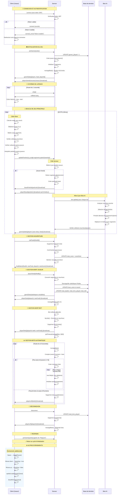

```mermaid
sequenceDiagram
    participant C as Client (Joueur)
    participant S as Serveur
    participant DB as Base de données
    participant B as Bots IA

    Note over C,S: 🔐 CONNEXION ET AUTHENTIFICATION
    C->>S: connect (avec token JWT)
    S->>S: Vérification token JWT
    alt Token valide
        S->>C: connect (succès)
    else Token invalide
        S->>C: connect_error("Token invalide")
        C->>C: Redirection vers page de connexion
    end

    Note over C,S: 🎮 INITIALISATION DU JEU
    C->>S: joinGame({color})
    S->>DB: UPDATE games_played + 1
    S->>S: Créer joueur dans players{}
    S->>S: Initialiser 5 segments
    S->>S: manageBots() - Ajuster nb de bots
    S->>C: gameState({players, food, playerId})
    S->>C: playerJoined(nouveauJoueur) [broadcast]

    Note over C,S: 📡 SYSTÈME DE LATENCE
    loop Toutes les 1 seconde
        C->>S: ping()
        S->>C: callback ping
        C->>C: Calcul latence = now - start
    end

    Note over C,S: 🎯 BOUCLE DE JEU PRINCIPALE
    loop 30 FPS (33ms)
        
        Note over C: Côté Client
        C->>C: Calculer angle vers souris
        C->>C: Déplacer joueur (x,y)
        C->>C: Mettre à jour segments
        C->>C: Vérifier collisions nourriture
        C->>C: Vérifier collisions autres joueurs
        C->>C: Interpoler positions autres joueurs
        C->>S: updatePosition({x,y,angle,segments,speed,boosting})
        
        Note over S: Côté Serveur
        S->>S: Mettre à jour position joueur
        alt Joueur boost
            S->>S: Retirer segment aléatoirement
            S->>S: Créer particule boost
            S->>C: boostParticle(particule) [broadcast]
        end
        S->>C: playerMoved(position) [broadcast sauf émetteur]
        
        Note over B,S: Mise à jour Bots IA
        S->>B: bot.update() pour chaque bot
        B->>B: Analyser nourriture proche
        B->>B: Détecter dangers/proies
        B->>B: Prendre décision (fuir/chasser/explorer)
        B->>B: Déplacer et mettre à jour segments
        B->>S: Vérifier collisions nourriture/joueurs
        
        S->>C: gameUpdate({players (avec bots), food}) [broadcast]
    end

    Note over C,S: 🍎 GESTION NOURRITURE
    C->>S: eatFood({foodId})
    S->>S: Supprimer food de la liste
    S->>S: Incrémenter score joueur
    S->>DB: UPDATE total_score + scoreGain
    S->>S: Générer nouvelle nourriture
    S->>C: foodEaten({foodId, newFood, playerId, newScore}) [broadcast]

    Note over C,S: 💀 GESTION MORT JOUEUR
    C->>S: playerDied({killedBy})
    S->>S: Convertir segments en nourriture
    S->>DB: Sauvegarder statistiques finales
    S->>DB: UPDATE best_score si record
    S->>DB: UPDATE total_deaths, total_time_played, total_kills
    S->>C: gameStats(statistiques complètes)
    S->>C: playerDied({playerId, newFood}) [broadcast]
    S->>S: manageBots() après 3s

    Note over C,S: 🤖 GESTION MORT BOT
    S->>S: Bot collision détectée
    S->>S: bot.die() - Convertir en nourriture
    S->>S: Supprimer bot de bots{}
    S->>C: playerDied({playerId: botId, newFood}) [broadcast]
    S->>S: setTimeout(manageBots, 3000)

    Note over C,S: 📊 GESTION BOTS AUTOMATIQUE
    loop Toutes les 10 secondes
        S->>S: manageBots()
        S->>S: Compter joueurs humains + bots
        alt Pas assez de joueurs (< 8)
            S->>S: Créer nouveaux bots
            loop Pour chaque nouveau bot
                S->>S: new Bot(id, nom aléatoire)
                S->>S: Initialiser position/segments
            end
        else Trop de bots et assez d'humains
            S->>S: Supprimer bots excédentaires
            S->>C: playerLeft(botId) [broadcast]
        end
    end

    Note over C,S: 🔌 DÉCONNEXION
    C->>S: disconnect
    S->>DB: UPDATE total_time_played
    S->>S: Supprimer de players{}
    S->>C: playerLeft(playerId) [broadcast]
    S->>S: manageBots() - Réajuster bots

    Note over C,S: 🔄 RESPAWN
    C->>S: joinGame({color}) [après clic "Rejouer"]
    Note over C,S: → Retour au cycle d'initialisation

    Note over C,S: ⏸️ AUTRES ÉVÉNEMENTS
    rect rgb(240, 248, 255)
        Note over C: Événements additionnels
        C->>C: Space → togglePause()
        C->>C: Mouse down → boosting = true
        C->>C: Mouse up → boosting = false
        C->>C: updateLeaderboard() [local]
        C->>C: drawMinimap() [local]
    end
```